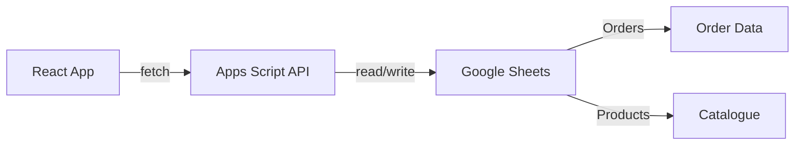

# Catalogue Order Portal - Backend Integration

This project is now **ready for Google Apps Script backend integration**.

## ✅ What's Been Done

### Frontend React App
- ✅ Complete order form with validation
- ✅ Dynamic catalogue loading from API
- ✅ Product selection with quantities
- ✅ Order totals calculation (18% tax)
- ✅ Order submission with API integration
- ✅ Confirmation view
- ✅ Loading states and error handling
- ✅ Offline fallback to mock data

### API Integration
- ✅ Environment-based API configuration
- ✅ `fetchCatalogue()` - Load products from Google Sheets
- ✅ `createOrder()` - Save orders to Google Sheets
- ✅ `loadOrder()` - Retrieve existing orders
- ✅ `updateOrder()` - Edit orders (future feature)

---

## 🚀 Next Steps: Connect to Google Sheets

### Step 1: Set Up Google Sheets (10 minutes)

Follow the complete guide in **`APPS_SCRIPT_SETUP.md`**

**Quick summary:**
1. Create Google Sheet with 3 tabs: Orders, Categories, Products
2. Add column headers (provided in guide)
3. Populate initial product data
4. Copy Spreadsheet ID from URL

### Step 2: Deploy Apps Script (10 minutes)

1. Open Apps Script editor from Google Sheet
2. Copy all code from **`Code.gs`** file in this project
3. Update the `SPREADSHEET_ID` constant
4. Deploy as Web App with "Anyone" access
5. Copy the Web App URL

### Step 3: Configure Frontend (1 minute)

1. Edit the `.env` file:
```bash
VITE_API_BASE_URL=https://script.google.com/macros/s/YOUR_SCRIPT_ID/exec
```

2. Restart the dev server:
```bash
npm run dev
```

### Step 4: Test! 🎉

1. Open http://localhost:5174
2. Fill out the order form
3. Select products and submit
4. Check your Google Sheet - you should see your order!

---

## 📚 Documentation Files

| File | Description |
|------|-------------|
| `APPS_SCRIPT_SETUP.md` | **Detailed step-by-step setup guide** with screenshots |
| `Code.gs` | **Complete Apps Script code** ready to copy-paste |
| `.env.example` | Template for environment configuration |
| `implementation_plan.md` | Full technical architecture and API design |
| `walkthrough.md` | Frontend features and testing guide |

---

## 🛠️ Development

```bash
# Install dependencies
npm install

# Run dev server
npm run dev

# Build for production  
npm run build
```

---

## 📦 What's in the Project

```
catalogue-ploughing/
├── src/
│   ├── api/
│   │   └── orderClient.ts      # API integration (✅ READY)
│   ├── components/             # UI components (✅ COMPLETE)
│   ├── features/order/         # Order page logic (✅ COMPLETE)
│   ├── data/
│   │   └── mockCatalogue.ts    # Offline fallback data
│   └── types/                  # TypeScript definitions
├── Code.gs                     # 📋 COPY THIS to Apps Script
├── APPS_SCRIPT_SETUP.md        # 📖 READ THIS for setup
└── .env                        # ⚙️ UPDATE THIS with your URL
```

---

## 🔗 How It Works



1. **React app** calls Apps Script API endpoints
2. **Apps Script** processes requests and talks to Google Sheets
3. **Google Sheets** stores orders and product catalogue

---

## ⚡ Quick Start (TL;DR)

1. Read `APPS_SCRIPT_SETUP.md`
2. Create Google Sheet + deploy `Code.gs`
3. Update `.env` with your API URL
4. Run `npm run dev`
5. Submit test order!

---

**Need help?** Check `APPS_SCRIPT_SETUP.md` for troubleshooting tips.

**Estimated setup time:** 20 minutes
