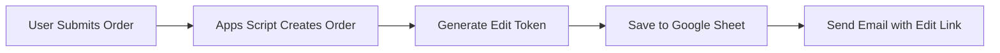
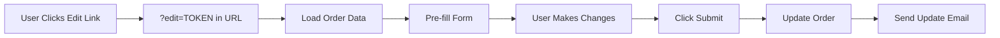

# Email Notifications & Edit Links - Setup Guide

## ⚠️ IMPORTANT: Update Your Google Sheet

The new functionality requires an additional column in your Orders sheet:

### Add This Column to Orders Sheet

Add column **M** (EditToken) to your Orders sheet:

| Column | Header | Description |
|--------|--------|-------------|
| M | EditToken | Unique token for edit links |

**How to add:**
1. Open your Google Sheets Orders tab
2. Click on column M header
3. Type: `EditToken`
4. Click outside to save

---

## 📧 Email Configuration

### Update Code.gs Configuration

In your `Code.gs` file, update this line:

```javascript
const FRONTEND_URL = 'http://localhost:5174';  // Change to your deployed URL when live
```

**For production:**
```javascript
const FRONTEND_URL = 'https://your-app.vercel.app';  // Your actual deployed URL
```

---

## 🎯 How It Works

### 1. Order Creation Flow



1. User fills form and clicks "Submit Order"
2. Order saved to Google Sheets with unique EditToken
3. Confirmation email sent automatically
4. Email contains clickable "Edit Your Order" button

### 2. Order Edit Flow



1. User clicks edit link from email
2. Frontend detects `?edit=TOKEN` parameter
3. Loads order by token from Google Sheets
4. Pre-fills user info and product quantities
5. Shows "Edit Mode" banner
6. User makes changes and submits
7. Order updated in Google Sheets
8. Update confirmation email sent

---

## 📨 Email Features

### Confirmation Email Includes:
- ✅ Order number and date
- ✅ Customer information
- ✅ Complete item list with prices
- ✅ Subtotal, tax, and grand total
- ✅ **Unique edit link (never expires)**
- ✅ Beautiful HTML formatting

### Email Preview:

```
┌─────────────────────────────────────┐
│   ✓ Order Confirmed!                │
│   Thank you for your order, John    │
├─────────────────────────────────────┤
│ Order ID: ORD-1704567890123         │
│ Date: 01/06/2026, 2:15 PM           │
│                                      │
│ Order Items:                        │
│ - Wireless Mouse x2 = $59.98        │
│ - Desk Lamp x1 = $39.99             │
│                                      │
│ Subtotal: $99.97                    │
│ Tax (18%): $17.99                   │
│ Grand Total: $117.96                │
│                                      │
│ ┌─────────────────────┐            │
│ │  Edit Your Order  📝 │  [Button]  │
│ └─────────────────────┘            │
└─────────────────────────────────────┘
```

---

## 🔐 Security Features

### Edit Tokens
- **Unique UUID** generated for each order
- **Never expires** - customer can edit anytime
- **Secure** - Cannot guess other orders' tokens
- Stored in EditToken column (column M)

### URL Format
```
http://localhost:5174?edit=a1b2c3d4-e5f6-7890-abcd-ef1234567890
```

---

## 🧪 Testing the Email Feature

### Step 1: Enable Gmail API (If Not Already)
Apps Script uses your Google account to send emails. No additional setup needed!

### Step 2: Test Email Sending

1. **Submit a test order** in your React app
2. **Check your inbox** (use the email you entered in the form)
3. You should receive a confirmation email within seconds

### Step 3: Test Edit Link

1. **Click "Edit Your Order"** button in the email
2. Browser should open: `http://localhost:5174?edit=TOKEN`
3. Form should pre-fill with your order data
4. Banner should show: "✏️ Edit Mode: You're updating order #ORD-XXX"
5. Make changes and submit
6. Check for update confirmation email

---

## 🎨 Customizing the Email

### Change Email Subject
In `Code.gs`, find the `sendOrderConfirmation` function:

```javascript
subject: `Order Confirmation #${orderId}`,  // Change this
```

### Customize Email Template
The HTML email template is in `Code.gs` around line 450. You can:
- Change colors by editing the `background` CSS
- Add your company logo
- Modify the text
- Add social media links

Example - Add Logo:
```html
<div class="header">
  
  <h1 style="margin: 0;">✓ Order Confirmed!</h1>
</div>
```

---

## 🚨 Troubleshooting

### Email Not Sending

**Problem:** Order created but no email received

**Solutions:**
1. Check spam/junk folder
2. Verify the email address in the form is correct
3. Check Apps Script logs:
   - Open Apps Script editor
   - Click **Executions** (left sidebar)
   - Look for errors in recent runs

4. Check quota limits:
   - Apps Script allows 100 emails/day for free accounts
   - Upgrade to Google Workspace for 1,500/day

### Edit Link Not Working

**Problem:** Click edit link but order doesn't load

**Solutions:**
1. Verify EditToken column exists in Orders sheet (column M)
2. Check browser console for errors (F12)
3. Verify `FRONTEND_URL` in Code.gs matches your app URL
4. Make sure the order exists in Google Sheets

### Edit Mode Shows Wrong Data

**Problem:** Order loads but shows different customer's data

**Solution:**
- This should never happen (tokens are unique)
- If it does, check that EditToken column has unique values
- Re-deploy Apps Script with latest code

---

## 📋 Email Quota Limits

| Account Type | Daily Email Limit |
|--------------|-------------------|
| Free Gmail | 100 emails/day |
| Google Workspace | 1,500 emails/day |

**Note:** Each order = 1 email. Each edit = 1 email.

---

## 🔄 Next Steps

After testing:

1. **Update FRONTEND_URL** in Code.gs when you deploy
2. **Customize email template** with your branding
3. **Test with multiple orders** to verify everything works
4. **Save the edit links** - they never expire!

---

## ✅ Checklist

- [ ] Added EditToken column (M) to Orders sheet
- [ ] Updated Code.gs with new code
- [ ] Deployed latest version of Apps Script
- [ ] Configured FRONTEND_URL
- [ ] Submitted test order
- [ ] Received confirmation email
- [ ] Tested edit link
- [ ] Received update confirmation email

**Everything working? You're ready to go live! 🚀**
